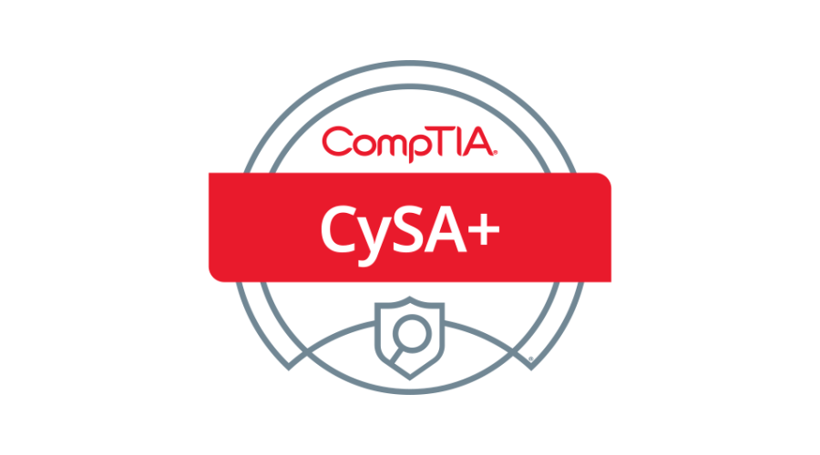

# CompTIA CySA+

**Where to buy:** [CySA+](https://www.comptia.org/en-us/certifications/cybersecurity-analyst/#buy-now)

*Price: $425*

---

## What is the CySA+?

CompTIA Cybersecurity Analyst (CySA+) is an intermediate-level certification that validates a professional’s ability to detect, prevent, and respond to cybersecurity threats through continuous security monitoring. It focuses on threat detection techniques, data analysis, vulnerability management, and incident response, bridging the gap between entry-level security skills and advanced cybersecurity operations. 

---

## Exam Objective Domains (Version 3)

| Domain | Topic                                               | % of Exam |
|--------|-----------------------------------------------------|-----------|
| 1.0    | Security Operations                                 | 33%       |
| 2.0    | Vulnability Management                              | 30%       |
| 3.0    | Incident Respone Management                         | 20%       |
| 4.0    | Reporting and Communication                         | 17%       |

For full objectives covered, see [CompTIA CySA+ Exam Objectives (Version 3)](https://www.comptia.org/en-us/certifications/cybersecurity-analyst/)

---

## What it covers

CySA+ focuses on behavioral analytics and threat detection to defend networks and systems. The exam dives into continuous security monitoring, vulnerability management, threat hunting, and incident response. It covers practical skills like analyzing security data, interpreting threat intelligence, and responding to real-world cybersecurity incidents.

The exam includes multiple-choice questions and performance-based tasks, where you apply your knowledge to detect and mitigate threats in realistic scenarios.

It’s designed for those actively working in security operations or analysts looking to improve their hands-on skills in defending against modern cyber threats.

---

## Jobs Associated with Gaining Certification
- Security Analyst  
- Threat Intelligence Analyst  
- SOC (Security Operations Center) Analyst  
- Incident Responder  
- Vulnerability Analyst  

---

## Notes
- Focuses heavily on behavioral analytics and real-world incident detection.  
- Requires some hands-on experience in security operations for best success.  
- Includes performance-based questions, so practical labs and exercises are helpful.  
- Emphasizes ongoing monitoring and response rather than just prevention.