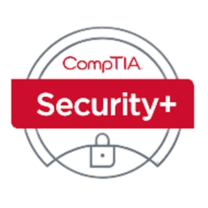

# CompTIA Security+

---

## What is CompTIA Security+ ?

CompTIA Security+ is a globally recognized certification that validates foundational skills in cybersecurity, focusing on risk management, threat analysis, and network security. 
It is one of the major certificates that is sought out after for cybersecurity to ensure the person has the basics of what cybersecurity is. 

---

## Exam Objective Domains (Version 701)

- 1.0: General Security Concepts                    (12% of Exam)
- 2.0: Threats, Vulnabilities, and Mitigrations     (22% of Exam)
- 3.0: Security Architecture                        (18% of Exam)
- 4.0: Security Operations                          (28% of Exam)
- 5.0: Security Program Management and Oversight    (20% of Exam)

For full objectives covered, see [CompTIA Security+ Exam Objectives (Version 701)](https://www.comptia.org/en-us/certifications/security/)

---

## What it covers

This exam covers the basic-intermediate information of cybersecurity. It is not too in-depth of topics, like the tools of cybersecurity, however, it does talk about real-world scenerios and how to apply security case-by-case scenerios. The exam does have both multiple choice questions(about 90% of the exam) and Performance-Based Questions(PBQs). Which PBQs are practical, scenario-driven tasks where you apply your knowledge to solve problems—like configuring a firewall, analyzing logs, or identifying vulnerabilities—rather than just answering multiple-choice questions. There are a few resources to go over them, but it is best to make sure you understand everything over just remembering. This exam is about not what you learn but also how you have/or will apply these objectives in real life. 
---

## My experience & Takeaways

I earned this [certification](https://www.certmetrics.com/comptia/public/verification.aspx?code=3T722F97KRK0VY38) in November 2024. I prepared and studied for this exam within a month, everyday I focused on it through various means of learning. I used [Professor Messer Security+ Course](https://www.professormesser.com/) on Youtube, along with going through the [Sybex Exam  Kit](http://amazon.com/CompTIA-Security-Certification-Kit-SY0-701/dp/1394211449/ref=pd_lpo_d_sccl_1/143-2992479-5473741?pd_rd_w=qH5BX&content-id=amzn1.sym.4c8c52db-06f8-4e42-8e56-912796f2ea6c&pf_rd_p=4c8c52db-06f8-4e42-8e56-912796f2ea6c&pf_rd_r=3DZ8H5K0M260749A5150&pd_rd_wg=sHinS&pd_rd_r=db930380-6bc2-4755-8948-da219385a4a1&pd_rd_i=1394211449&psc=1) multiple times. I took extensive notes for each section, highlighting anything important from the book, and testing myself with the practice tests associated with the Sybex book kit. When I first started I did an 80/20 learning method of where I read and took notes for 80% of my time, and then 20% going back over and testing myself with the practice tests or trying to remember port  numbers, acronyms, etc. Then by the end of my study time I flipped it, where I took notes or re-read the stuff I was unsure about and tested myself 80% of that time. I used various practice tests from Youtube, Quizlet, Professor Messer Practice Tests, Sybex Practice Tests, and even CompTIA's practice questions that they have on their website. I did have a little bit of knowledge prior with having a bachlor's degree in computer science but never did much with cybersecurity topic, so I first did a little research and even did the [Google Cybersecurity Certificate](https://grow.google/enroll-certificates/cybersecurity-mid/?gad_campaignid=22435284945&gwg_campaign_id=22435284945) to get my foundation. However, I did study for a month and passed the exam first try. I did not get 100%, there were a few questions I was unsure about, but after taking the exam, I was shown the topics I missed. It didn't show me the questions, just the topics, like "2.3: Explain various types of vulnabilities." This helped me go back through and strengthened those topics that I missed. Overall the exam was a bit difficult, the wording was hard to understand with the questions, so beware of that, make sure to read every question carefully. The performance-based questions were the more difficult parts and had a lot of variables to fill out. But I did learn a lot throughout the experience and I apply them today with projects and while I cover other topics like networking or using a tool like Wireshark. 

---

## Jobs Assoicated with Gaining Certification

- Systems/Security Administrator
- IT Support Technician
- Cybersecurity Analyst
- SOC Analyst

---

## Notes

- Don't just study, apply what you studied and learned. Use the tools and research further into topics. 
- Make sure you have the most up-to-date version objectives in which you are planning on taking
- Use multiple resources as talked about above 
- Remember the port numbers, all the acronyms(There is a lot!), standards(e.g., NIST), tools, and any important definitions