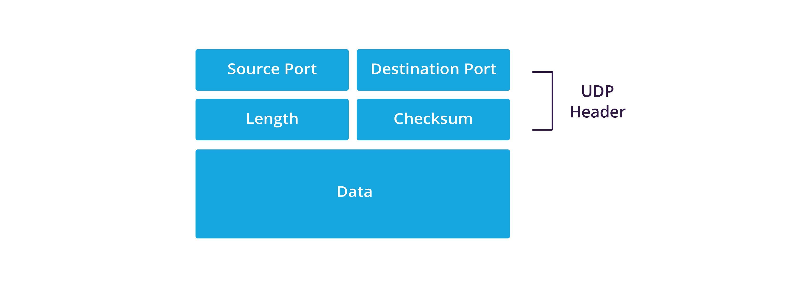

# Transmission Control Protocol (TCP) and User Datagram Protocol (UDP)

## Description
TCP and UDP are two **Transport Layer (Host-to-Host) protocols** used for sending data between devices. Each application or service communicates over a **port**, which uses either TCP, UDP, or sometimes both, depending on the requirements of the application.  

- **TCP** is connection-oriented, reliable, and ensures data arrives in the correct order.  
- **UDP** is connectionless, faster, and suitable for applications where speed is more important than guaranteed delivery.  

In simpler terms, TCP is like sending a registered letter with tracking and confirmation, while UDP is like sending a postcard—quick, but without guarantees that it will arrive or in what order.

---

## Transmission Control Protocol (TCP)

TCP takes large blocks of data from an application and breaks them into smaller **segments**. Each segment is **numbered and sequenced**, allowing the destination's TCP process to reassemble them in the correct order, exactly as the sending application intended. After sending, the transmitting TCP process waits for **acknowledgments** from the receiving TCP. Segments that are not acknowledged are **retransmitted** to ensure reliable delivery.

TCP establishes communication using a **three-way handshake**, which sets up a **connection-oriented session** between two devices. This handshake ensures both devices are ready to send and receive data reliably.

TCP is a **full-duplex, connection-oriented, reliable, and accurate** protocol. While these features make TCP robust, they also add overhead, making it **slower than connectionless protocols like UDP**. TCP also includes built-in error checking to maintain data integrity.

Here is the TCP segment format:

### Fields in the TCP Segment

- **Source Port:** The port number of the application sending the data.  
- **Destination Port:** The port number of the application receiving the data.  
- **Sequence Number:** Identifies the order of the first byte in this segment relative to the start of the data stream.  
- **Acknowledgment Number:** If the ACK flag is set, this field contains the next expected byte from the sender.  
- **Header Length (Data Offset):** Indicates where the data begins in the segment.  
- **Reserved:** Reserved for future use; should be set to 0.  
- **Flags (Control Bits/TCP Flags):** Includes SYN, ACK, FIN, RST, PSH, URG flags to control the state of the connection.  
- **Window:** Specifies the size of the sender's receive window, controlling flow.  
- **Checksum:** Used for error-checking the header and data.  
- **Urgent Pointer:** Points to urgent data if the URG flag is set.  
- **Options:** Additional features like Maximum Segment Size (MSS), timestamps, or selective acknowledgments (SACK).  
- **Payload (Data):** The actual application data being transmitted.  

--- 

## User Datagram Protocol (UDP)

UDP is a **connectionless, lightweight Transport Layer protocol**. Unlike TCP, it does not establish a connection before sending data, and it does not guarantee delivery, sequencing, or error correction. This makes UDP faster and more efficient for applications where speed is critical and occasional data loss is acceptable, such as video streaming, online gaming, or DNS queries.  

UDP sends data in **datagrams**, which are self-contained packets that contain all the information needed to reach the destination. Each datagram is independent, so if one is lost, the others are not affected.  

In simpler terms, UDP is like sending multiple postcards—each is delivered on its own, without confirmation, but most arrive quickly and in roughly the right order.

  

### Fields in the UDP Segment:
- **Source Port:** The port of the sending application.  
- **Destination Port:** The port of the receiving application.  
- **Length:** The length of the UDP header and data in bytes.  
- **Checksum:** A simple error-checking value used to verify data integrity.  
- **Payload (Data):** The actual data being transmitted.  

---

## Key features breakdown:

| **TCP** | **UDP** |
|---------|---------|
| Sequenced | Unsequenced |
| Reliable | Unreliable |
| Connection-Oriented | Connectionless |
| Virtual Circuit | Low Overhead |
| Acknowledgments | No Acknowledgments |
| Windowing Flow Control | No Windowing or Flow Control |