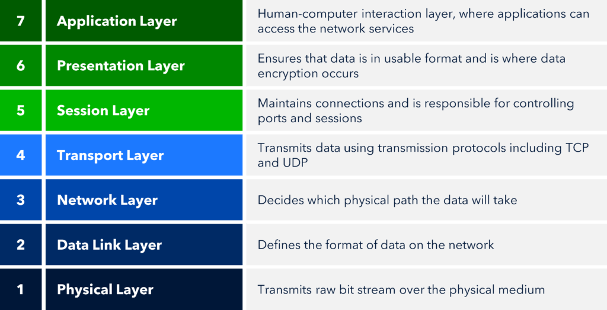

# Open Systems Interconnection (OSI) Model

## Description:
The OSI Model is a standardized reference framework made up of seven distinct layers. It was created to ensure that computers and devices from different manufacturers can communicate effectively. The model provides guidelines for how vendors can design interoperable network devices and software by following common protocols and standards, enabling different networks to work together seamlessly.

In simpler terms, the OSI Model is like a universal set of rules that lets technology from different brands “speak the same language” so they can share information without confusion.

As talked about, there are seven different layers that represents the state of the computer architecture. 

These seven layers are: 7.) Appication, 6.)Presentation, 5.) Session, 4.) Transport, 3.) Network, 2.) Data Link and 1.) Physical Layers. 

A diagram is below to show each layer and what 

## Diagram:

---

## Breaking Down the Layers

The **first three layers**—Layers 1 to 3 (Physical, Data Link, and Network)—are known as the **Media Layers**. These layers handle the transmission of the raw bits that make up network traffic, organize those bits into frames or logical groups, and ensure that networks of systems and devices operate correctly using addressing, routing, and traffic control methods.

The **next four layers**—Layers 4 to 7 (Transport, Session, Presentation, and Application)—are called the **Host Layers**. They focus on tasks like ensuring reliable data delivery, managing communication sessions, encrypting and decrypting information, and translating data between the application and the network so that APIs and other high-level tools function as intended.

The **top three layers**—Layers 5 to 7 (Application, Presentation, and Session)—define the rules for how applications on different hosts communicate with each other and interact with end users. These layers focus on software-level communication and are unaware of the details of networking hardware or network addresses.

The **bottom four layers**—Layers 1 to 4 (Transport, Network, Data Link, and Physical)—define how data is physically transmitted from one point to another. They deal with moving data through cables, switches, and routers, and with reassembling the data stream from the sending host so it can be used by the receiving host’s application.

**In plain English:**  
Think of the OSI Model like mailing a package: the bottom layers are the trucks, roads, and delivery routes that physically move the box, while the top layers are the labels, instructions, and handshakes that make sure the right person opens it and understands what’s inside.

---

### Ways to remember the order(mnemonics):
- **P**lease **D**o **N**ot **T**hrow **S**ausage **P**izza **A**way.   Layer 1 -> Layer 7
- **A**ll **P**eople **S**eem **T**o **N**eed **D**ata **P**rocessing.  Layer 7 -> Layer 1

---

## Each Layer:

### Application Layer (Layer 7):

This layer represents the point of interaction between humans and computers, where users communicate with a system through software. Technically, the user does not interact directly with the Application Layer itself. Instead, they interact with the network stack through application processes, user interfaces, or application programming interfaces (APIs) that link the application in use to the computer’s operating system.

The Application Layer serves as an interface between the application program and the network services. For example, web browsers like Chrome are not part of the Application Layer, but they use its protocols when they need to access remote resources. 

This layer is also responsible for identifying and establishing the availability of a communication partner and determining whether there are sufficient resources to support the requested communication.

Anything you see on the screen from the application—such as messages, prompts, or displayed data—is often considered **Layer 7 information**.

**In plain English:**  
The Application Layer is like the receptionist at an office—you're not talking directly to the building’s infrastructure, but the receptionist connects you to the right department, checks if they’re available, and makes sure you can communicate effectively.

### Presentation Layer (Layer 6):

The Presentation Layer is responsible for formatting and presenting data to the Application Layer. Its main functions include data translation, code formatting, data compression and decompression, as well as encryption and decryption. This ensures that data sent from one system’s Application Layer can be correctly interpreted by another system’s Application Layer. For example, it handles the conversion of Unicode to ASCII or other encoding formats.

A real-world example of this layer in action is when you visit a website using SSL or TLS. The Presentation Layer manages the encryption of your data before sending it and decrypts it upon receipt, ensuring that sensitive information remains secure during transmission.

**In plain English:**  
Think of the Presentation Layer as a translator or document formatter—it makes sure that data coming from one system can be understood by another, just like translating a document into a language someone else can read.

### Session Layer (Layer 5):
The Session Layer is responsible for establishing, managing, authenticating, and terminating sessions between Presentation Layer entities. It coordinates communication between systems and organizes their interactions by supporting three modes:

1. **Simplex** – One-way communication  
2. **Half-Duplex** – Both directions, but only one at a time  
3. **Full-Duplex** – Both directions simultaneously  

The Session Layer also ensures that each application’s data remains separate from data of other applications, preventing mix-ups and maintaining organized communication streams.

**In plain English:**  
Think of the Session Layer as a meeting organizer—it sets up the “meeting” between applications, keeps track of who is speaking when, and ensures each conversation stays separate and orderly.

### Transport Layer (Layer 4):

The Transport Layer segments and reassembles data into a continuous data stream. Its main purposes are reliable data transmission, error detection, and flow control. It also provides mechanisms for multiplexing upper-layer applications, establishing virtual connections, and tearing down those connections when communication is complete.  

The term *reliable networking* in the Transport Layer context refers to the use of **acknowledgments**, **sequencing**, and **flow control** to ensure data is delivered accurately and in order.

**Examples:** Transmission Control Protocol (TCP) and User Datagram Protocol (UDP)

The Transport Layer can operate in two modes:

- **Connectionless:** Data is sent without establishing a prior connection (e.g., UDP).  
- **Connection-Oriented:** A connection is established before data is sent (e.g., TCP). The sender and receiver agree on communication parameters, including the amount of data to transmit, before transmission begins.

#### TCP Three-Way Handshake (Connection-Oriented Example)
1. **SYN:** The sender requests synchronization to initiate a connection.  
2. **SYN/ACK:** The receiver acknowledges the request and synchronizes its sequence numbers with the sender.  
3. **ACK:** The sender confirms the connection has been established, and data transfer can begin.

**Flow Control:** Ensures the receiver can control the amount of data sent by the sender, preventing buffer overflow on the receiving side.

**Connection-Oriented Services Requirements:**
1. Establish a virtual circuit (e.g., via a three-way handshake)  
2. Use sequencing to maintain proper data order  
3. Implement acknowledgments to confirm receipt  
4. Apply flow control to prevent congestion

**Windowing:** Determines the number of unacknowledged data segments (in bytes) a sender can transmit before waiting for an acknowledgment, controlling the flow of data effectively.

### Network Layer (Layer 3):

The Network Layer manages logical addressing, determines device locations on the network, and selects the best path for data to travel. Its main functions include routing, addressing, and making path decisions to move data between devices across multiple networks. This layer primarily deals with IP addresses and subnetting, as well as how routers forward traffic. **Routers are Layer 3 devices.**

Types of Packets at the Network Layer:
1. **Route-Update Packets:** Share information with neighboring routers about networks connected within the same internetwork.  
   - Routing protocols: Routing Information Protocol (RIP), Enhanced Interior Gateway Routing Protocol (EIGRP), Open Shortest Path First (OSPF)  
2. **Data Packets:** Carry user data across the internetwork.  
   - Protocols: Internet Protocol (IP), Internet Protocol version 6 (IPv6)  

Key Concepts:
- **Network Addresses:** Protocol-specific addresses used to identify devices on a network.  
- **Interface:** The exit point a packet takes when leaving a device toward a specific network.  
- **Metric:** A value representing the cost or distance to reach a destination network.

Protocol Examples:
- IP, IPv6, ICMP (Internet Control Message Protocol), IGMP (Internet Group Management Protocol)  
- Routing Protocols: RIP, OSPF, EIGRP, BGP (Border Gateway Protocol)

### Data Link Layer (Layer 2):

The Data Link Layer provides the physical transmission of data and manages error notification, network topology, and flow control. It ensures that messages are delivered to the correct device on a LAN using hardware (MAC) addresses and translates messages from the Network Layer into bits for the Physical Layer to transmit. This layer is responsible for the unique identification of each device on a local network.

Sublayers of the Data Link Layer:

1. **Media Access Control (MAC):** Defines how packets are placed onto the physical media. Responsible for physical addressing and controlling access to the network medium.  
2. **Logical Link Control (LLC):** Identifies Network Layer protocols and encapsulates them into frames. The LLC header informs the Data Link Layer how to process the received frame.

Protocol Examples:
- Ethernet (IEEE 802.3)  
- Wi-Fi (IEEE 802.11)  
- PPP (Point-to-Point Protocol)  
- Frame Relay  
- ATM (Asynchronous Transfer Mode)

### Physical Layer (Layer 1):

The Physical Layer is the lowest layer of the OSI model and is responsible for transmitting raw bits over a physical medium. Bits are represented as electrical, optical, or radio signals (0s and 1s). This layer defines the electrical, mechanical, procedural, and functional specifications for activating, maintaining, and deactivating physical connections between devices.

Protocol/Technology Examples:
- Ethernet cabling (Cat5, Cat6)  
- Fiber optics  
- USB  
- Bluetooth  
- DSL/ISDN

---

## Data Encapsulation
Data encapsulation is when a host transmits data across a netwrok to another device. To be able to communicate and exchange information, each layer uses a Protocol Data Units (PDU). The PDUs represents what state the data is in for each layer of the OSI model. As you can see below, each layer has a PDU associated with it. 

| PDU | Layer |
------|--------
| Datagrams | Application |
| Datagrams | Presentation |
| Datagrams | Session |
| Segments | Transport |
| Packets | Network |
| Frames | Data Link |
| Bits | Physical |

## Reference/Resources:
- Chapter 2,6 from Network+ Sybex Study Guide
- Chapter 12 from Security+ Sybex Study Guide
- [Professor Messer](https://www.professormesser.com/network-plus/n10-009/n10-009-video/understanding-the-osi-model-n10-009/)