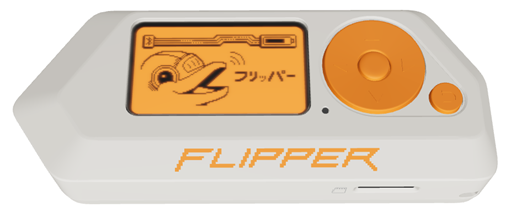

# Flipper Zero



**Where to buy:** [Flipper Zero](https://flipperzero.one/)

---

## What is a Flipper Zero Device?

The Flipper Zero is a compact, portable multi-tool designed for pentesters, cybersecurity enthusiasts, hackers, and even hobbyists who want to explore hardware hacking or have some fun with tech pranks. It combines various radio protocols, GPIO pins, infrared control, RFID/NFC capabilities, and more into a single handheld device with an easy-to-use interface. 

## Common Uses:
- Radio frequency (RF) signal sniffing and replay (e.g., garage remotes, car keys)
- RFID and NFC tag reading, emulation, and cloning
- Infrared remote control emulation
- GPIO pin interaction for hardware debugging and hacking
- Signal jamming and fuzzing
- Storage of scripts and payloads for quick deployment
- Game device

## Where it's useful:
- Physical security assessments and penetration tests
- IoT device testing
- Wireless protocol research and exploitation
- Hobbyist projects and learning hardware hacking
- Tech pranks and demonstrations

---

## The Features in detial:

### Radio Frequency Identification (RFID):
This tool is used to scan low-frequency proximity cards nearby. This type of card is used in multiple cases throughout the world, from hospital badges to get into building, geotags, pet chips, merchandise, and various other uses. These RFIDs store only N-byte ID and has no authentication mechanism. Which allows it be read, cloned and then emulated by anyone with a device like the Flipper Zero. 
With the Flipper Zero device, all that is needed is to turn on the ```read``` mode, hold it near a RFID, which the device has a 125 kHz antenna to read. The interface will show that it is trying to read the RFID. Once it reads and gains the information of the RFID, you are allowed to save it or not. The device is able to store multiple RFIDs, to where the user can then emulate the RFID signal to gain access into buildings or simulate the signal.

### Near Field Comminication (NFC):
This tool is similar to the RFID tool, but allowing to gain information from a NFC-enabled devices. NFC-enabled devices are also used heavily now, usually associated with payments. These devices are embedded in your phones, smart watches, and credit/debit cards, where one uses it to pay for items. 
Again with the Flipper Zero, you are able to hold near a NFC device like a debit card, read the information off of it. Which you only gain most of the information, not all of it, like the CVV. Then after recieving the information, you can save it and then later emulate it. 

### Sub-GHz Radio:

### Infrared:

### GPIO:

### USB/Bad KB:

### iButton:

### U2F:

### Video Games:


