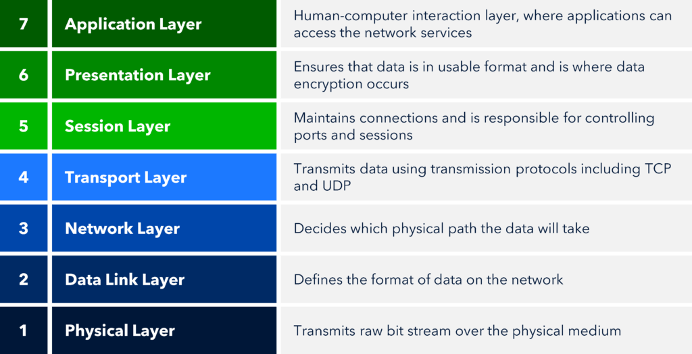

# Open Systems Interconnection (OSI) Model

## Description:
The OSI Model is a reference interconnection model that is made up of 7 layers. This model is used to help computers from different manufacturer's communicate together. It is to show how vendors can create interoperable network devices and software in the form of protocols, or standards so that different vendors' networks could become compatible and work together. 

As talked about, there are seven different layers that represents the state of the computer architecture. These seven layers are: 7.) Appication, 6.)Presentation, 5.) Session, 4.) Transport, 3.) Network, 2.) Data Link and 1.) Physical Layers. A diagram is below to show each layer and what 

## Diagram:

## Breaking down the layers:
The first three layers, layers 1-3 (Physical, Data Link and Network), are considered the **Media Layers**. The Media Layers are used to transmit the bits that make up network traffic, to transmit frames or logical groups of bits, and to make networks of systems or devices work properly using addressing, routing, and traffic control schemes.

The next four layers, layers 4-7 (Transport, Session, Presentation, and Application), are considered the **Host Layers**. The Host Layers adress things like reliable data transmissions, session management, encryption, and translation of data from the application to the network and back works, and that APIs and other high-level tools work.   

The top three layers, layers 5-7 (Application, Presentation, and Session), help define the rules of how the applications working together within host machines communicate with each other as well as with the end users. The upper layers are responsible for applications communicating between hosts. These upper layers do not know anything about networking or network addresses.

The bottom four layers, layers 1-4 (Transport, Network, Data Link, and Physical), help define how the acutal data is transmitted from end to end. The bottom four layers define how data is transferred through physical media, switches, and routers. They also determine how to rebuild a data stream from a transmitting host to a destination host's appplication. 

## Each Layer:

### Ways to remember the order(mnemonics):
- **(P)**lease **(D)**o **N**ot **(T)**hrow **(S)**ausage **(P)**izza **(A)**way.   Layer 1 -> Layer 7
- **(A)**ll **(P)**eople **(S)**eem **(T)**o **(N)**eed **(D)**ata **(P)**rocessing.  Layer 7 -> Layer 1

### Layer 7 (Application Layer):
This layer is the human to computer interaction, where the users actually communicate/interact with the computer. Technically the user doesn't interact directly with the Application Layer, the user instead interacts with the network stack through application processs, interfaces, or application programming interfaces (APIs) that connect the application in use to the OS of the computer. The Application Layer acts as an interface between the application program, so browsers like Chrome don't reside within the Application Layer, they interface with the Application Layer protocols when they need to deal with remote resources. 

The Application Layer also is responsibe for identifying and establishing the availability of the intended communication partner and determining whether sufficient resources for the requested communcation exist. 

Anything that you’re seeing on the screen, the application itself or any messages from the application, are often referred to as layer 7 information.

### Layer 6 (Presentation Layer):
This layer formats and presents the data to the Application Layer and is responsible for data translation and code formatting. There are also a few other key responsibilies that this layer has like data compression, decompression, encryption, and decryption. The Presentation Layer ensures that the data transferred from one system's Application Layer can be read and understood by another Application Layer from another system. Examples of this is like the conversion of Unicode to ASCII. 

An example of this process is if you are communicating to a website and you are using SSL or TLS to be able to encrpyt and decrypt that data.

### Layer 5 (Session):
This layer is responsible for setting up, managing, authenticating and then tearing down sessions between Presentation Layer entities. It coordinates communication between systems and serves to organize their communcation by offering three different modes:

1. One Direction (Simplex)
2. Both Directions, but only one direction at a time (Half-Duplex)
3. Bidiectional, both ways at same time (Full-Duplex)

The Session Layers basically keeps an application's data seperate from other application's data. 

### Layer 4 (Transport):
This layer segments and reassembles data into a data stream. Its main purposes are the transmission of data and error control. The Transport Layer provides the mechanisms for multiplexing upper-layer applications, establishing virtual connections, and tearing down virtual circuits. 

The term *reliable networking* relates to the Transport Layer and means **acknowledgments**, **sequencing** and **flow control** will be used. 

**Examples**: Transmission Control Protocol (TCP) and User Datagram Protocol (UDP)

The Transport Layer can be connectionless or connection-oriented (reliable). 

- **Connectionless**: 

- **Connection-Oriented**: Before a transmitting host starts to send segments down the OSI layered model, the sender's TCP process contacts the destination's TCP process to establish a connection. They also agree on the amount of information that will be sent in either direction before the acknowledgment segment.

The TCP three-way handshake that is needed for connection-oriented:
1. **SYN** The first "connection agreement" segment is a request for synchronization.   
2. **SYN/ACK** This segment acknowledge the request and establish connection parameters, the rules, between the hosts. These segments request that the receiver's sequencing is synchronized here as well so that a bidirectional connection is formed.
3. **ACK** The last segment is also an acknowledgment. It notifies the destination host that the connection agreement has been accepted and that the connection has been established. Data now can be transfered.

**Flow Control**: Provides a means for the receiver to govern the amount of data send by the sender. It prevents a sending host on one side from overflowing the buffers in the receiving host. 

**What makes a service considered connection-oriented:**
1. A virtual circuit is set up (such as a three-way handshake)
2. Uses sequencing
3. Uses acknowledgments
4. Uses flow control

**Windowing**: The quantity of data segments (measured in bytes) that the transmitting machine is allowed to send without receiving an acknowledgment. It is used to control the amount of outstanding, unacknowledged data segments.

### Layer 3 (Network Layer):
This layer manages logical device addressing, tracks the location of the devices on the network, and determines the best way to move data. It's main functions are physical path decisions, addressing and routing. It is referring to IP addresses, so anything that has an IP address or a subnet mask or referring to the way that routers forward traffic.  **Routers are layer 3 devices.**

There are two types of packets used at the Network Layer:

1. **Route-Update Packet**: Used to update neighboring routers about the networks connected to all routers within the same internetwork. Routing protocols: Routing Information Protocol (RIP), Enhanced Interior Gateway Routing Protocol (EIGRP), and Open Shortest Path First (OSPF)
2. **Data Packets**: Used to transport user data through the internetwork. Routing protocols: Internet Protocol (IP) and Internet Protocol version 6  (IPv6)

**Network Addresses**: Are protocol-specific network addresses.
**Interface**: The exit interface a packet will take when destined for a specific network.
**Metric**: Value equals the distance traveled to the remote network.

### Layer 2 (Data Link Layer):
This layer provides the physical transmission of the data and handles error notifcication, network topology, and flow control. It ensures that messages are delivered to the proper device on an LAN using hardware (MAC) adresses and translates messages from the Network Layer into bits for the Physical Layer to transmit. The Data Link Layer is responsible for the unique identification of each device that reside on a local network. 

The two sublayers of Data Link Layer:

1. **Media Access Control (MAC)**: Defines how packets are placed on the media. Physical addressing is defined here and so are logical topologies. 
2. **Logical Link Control (LLC)**: Responible for identifying Network Layer protocols and then encaspulating them. An LLC header tells the Data Link Layer what to do with a packet once a frame is received.

### Layer 1 (Physical Layer):
This layer is the final layer, which does two important things: It sends bits and receives bits. Bits are represented by 0 or 1. This layer specifies the electical, machanical, procedural and functional requirements for activating, maintaing, and deactivating a physcial link between end systems.

## Data Encapsulation
Data encapsulation is when a host transmits data across a netwrok to another device. To be able to communicate and exchange information, each layer uses a Protocol Data Units (PDU). The PDUs represents what state the data is in for each layer of the OSI model. As you can see below, each layer has a PDU associated with it. 

| PDU | Layer |
------|--------
| Datagrams | Application |
| Datagrams | Presentation |
| Datagrams | Session |
| Segments | Transport |
| Packets | Network |
| Frames | Data Link |
| Bits | Physical |

## Questions:
1.) 

## Reference/Resources:
- Chapter 2,6 from Network+ Sybex
- Chapter 12 from Security+ Sybex
- [Professor Messer](https://www.professormesser.com/network-plus/n10-009/n10-009-video/understanding-the-osi-model-n10-009/)